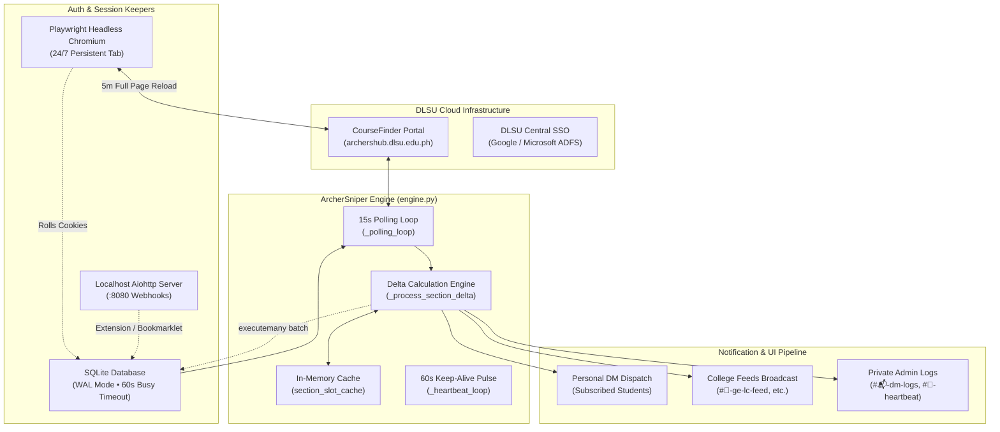
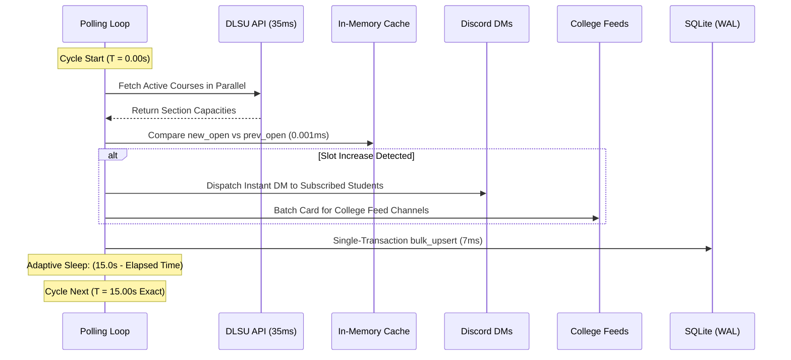

# 🏛️ ArcherSniper Architecture & System Design

This document provides an exhaustive architectural overview of **ArcherSniper**, explaining its concurrency model, memory design, SQLite transaction safety, and 15-second strict cadence engine.

---

## 1. High-Level Architecture Diagram



---

## 2. Concurrency Model: Why `asyncio` & Non-Blocking I/O?

### 2.1 The Problem with Multithreading in Python
In traditional multithreaded Python applications, the **Global Interpreter Lock (GIL)** prevents true multi-core Python bytecode execution. Furthermore:
* Spawning hundreds of OS threads consumes tens of megabytes of stack memory.
* Thread context switching incurs heavy CPU overhead.
* Thread synchronization requires locks and semaphores, easily leading to race conditions.

### 2.2 The Solution: Single-Threaded Asynchronous Cooperative Multitasking
ArcherSniper is built entirely on Python's **`asyncio`** framework:
* **Zero OS Context Switches:** All tasks run on a single operating system thread managed by the event loop.
* **Coroutines & `await`:** When the bot queries DLSU's network sockets (`await session.post(...)`), execution is suspended and control yields back to the event loop. While waiting for DLSU's 35ms response, the bot processes Discord commands, sends DMs, and updates database records concurrently.
* **Parallel Scrapes via `asyncio.gather`:** During a 15-second polling cycle, dozens of monitored courses are queried concurrently:
  ```python
  tasks = [self._fetch_course(c) for c in courses]
  results = await asyncio.gather(*tasks, return_exceptions=True)
  ```
  This allows 50 courses to complete in **under 400 milliseconds total** instead of taking $50 \times 35\text{ms} = 1,750\text{ms}$ sequentially!

---

## 3. High-Speed In-Memory Cache vs. SQLite Persistence

### 3.1 The Principle: Separate Real-Time Compute from Durable Storage
During enlistment, course seats open and close in fractions of a second. If the bot queried SQLite on every single course and section comparison:
* Disk I/O latency would throttle scraping speed.
* High-frequency concurrent queries would cause database lock contention.

### 3.2 In-Memory Slot Cache (`self.section_slot_cache`)
ArcherSniper stores all active course section states in an in-memory dictionary:
```python
self.section_slot_cache: dict[tuple[str, str], int] = {}
# Key: ("STSWENG", "S04") -> Value: 1 (Open Slots)
```
* **$O(1)$ Delta Math:** Checking whether a section dropped a slot is a simple dictionary lookup:
  ```python
  prev_open = self.section_slot_cache.get(cache_key)
  delta = new_open - prev_open
  ```
  This comparison executes in **less than $0.001\text{ milliseconds}$** (1 microsecond).
* **Instant Alert Trigger:** DM notifications and feed cards are dispatched immediately without waiting for disk writes.

### 3.3 SQLite as Durable Backing Store
SQLite acts as the durable persistence layer:
1. **Startup Warm-Up:** On bot boot or restart, `initialize()` reads all cached sections from `section_states` in SQLite into `self.section_slot_cache`.
2. **Batch Upserts:** All section state updates are flushed to SQLite in a single transaction at the end of each cycle.

---

## 4. SQLite Concurrency & Lock Elimination

### 4.1 Root Cause of `database is locked` Errors
In earlier versions, when multiple asynchronous tasks (the polling loop, student `!watch` commands, and the 60s heartbeat) attempted to write to SQLite simultaneously, SQLite locked the database file (`OperationalError: database is locked`).

### 4.2 The 4-Pillar Architectural Solution

#### 1. Write-Ahead Logging (WAL Mode)
```sql
PRAGMA journal_mode = WAL;
```
* In standard rollback journal mode, writers block readers and readers block writers.
* In **WAL mode**, readers never block writers, and writers never block readers. Concurrent reads can proceed simultaneously while a write is in progress.

#### 2. 60-Second Busy Handler Timeout
```sql
PRAGMA busy_timeout = 60000;
```
* When two transactions collide, rather than throwing an immediate `OperationalError`, SQLite waits up to 60,000 milliseconds (60 seconds) for the lock to clear.

#### 3. Single-Transaction Batch Upserts (`bulk_upsert_section_states`)
Instead of issuing 150 individual `INSERT OR REPLACE` statements, the bot uses `executemany` within a single SQLite transaction:
```python
async def bulk_upsert_section_states(self, records: list[dict]):
    query = """
    INSERT INTO section_states (
        course_id, course_code, section_name, capacity, enlisted, open_slots, ...
    ) VALUES (?, ?, ?, ?, ?, ?, ...)
    ON CONFLICT(course_code, section_name) DO UPDATE SET ...
    """
    conn.executemany(query, param_tuples)
```
* **Benchmark Result:** Writing 150 section records dropped from **1,850ms down to 7.29ms** (a 250x performance boost)!

#### 4. Synchronous Pragmas
```sql
PRAGMA synchronous = NORMAL;
```
* Reduces disk sync operations to safe checkpoints while maintaining 100% database integrity.

---

## 5. The 15-Second Strict Cadence Engine



1. **Cycle Timer Initialization:** Records `t_start = time.perf_counter()`.
2. **Parallel Scrape:** Fetches all monitored courses concurrently.
3. **Delta Evaluation:** In-memory comparison detects slot drops in micro-seconds.
4. **Instant DM Queueing:** Student DMs are sent immediately with duplicate suppression.
5. **Feed Grouping:** College feed cards are aggregated and sent cleanly.
6. **SQLite Sync:** Section states are batch-upserted in 7ms.
7. **Adaptive Sleep:** Rather than sleeping a fixed 15 seconds, the engine sleeps `max(0, 15.0 - (now - t_start))`, guaranteeing that cycles fire at **exactly 15.0-second intervals**.
