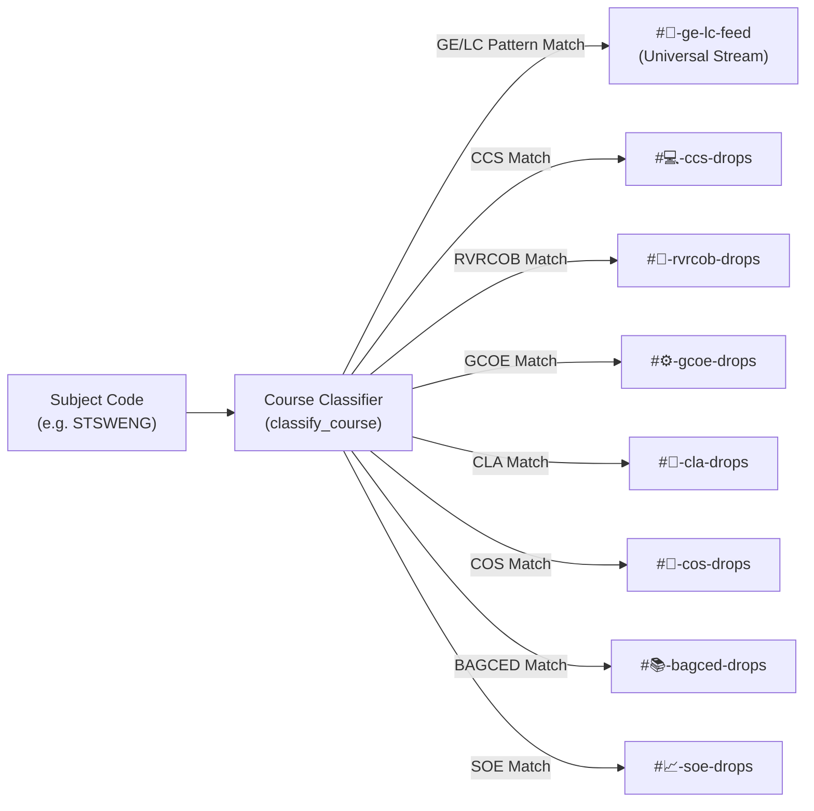

# 🎯 Course Classification & Notification Dispatch

This document details the regex classification system for DLSU subjects, multi-college feed routing, personal DM delivery rules, and the zero-ping policy.

---

## 1. DLSU Subject Classification Architecture (`utils/classifier.py`)

DLSU course codes consist of department prefixes followed by course levels (e.g., `STSWENG`, `CCPROG1`, `GEWORLD`, `KOBALAC`).

The classifier matches prefixes against comprehensive college department rules:



### Classification Rules

1. **General Education & Lasallian Core (GE/LC):**
   * Prefixes: `GE` (GEWORLD, GETHICS, GEMATMW, GELFBUS, etc.)
   * Prefixes: `LC` (LCFAITH, LCLSONE, LCTHONE, LCFILIC, etc.)
   * Prefixes: `SAS` (SAS1000, SAS2000, SAS3000)
   * Prefixes: `LASARE` (LASARE1, LASARE2, LASARE3)
   * Prefixes: `NSTP` (NSTP101, NSTPCW1, NSTPRO1)
2. **College of Computer Studies (CCS):**
   * Prefixes: `CC`, `CS`, `IT`, `IS`, `DS`, `ST`, `NS`, `MC`, `TH`
3. **Ramon V. del Rosario College of Business (RVRCOB):**
   * Prefixes: `AC`, `CO`, `DS`, `EC`, `FM`, `IB`, `MK`, `MG`, `MO`, `OP`, `TA`
4. **Gokongwei College of Engineering (GCOE):**
   * Prefixes: `CE`, `CH`, `EE`, `IE`, `ME`, `MN`, `EN`, `MECE`
5. **College of Liberal Arts (CLA):**
   * Prefixes: `CO`, `IN`, `HI`, `LI`, `PH`, `PO`, `PS`, `SO`, `IS`
6. **College of Science (COS):**
   * Prefixes: `BI`, `CH`, `MA`, `PH`, `ES`
7. **Br. Andrew Gonzalez College of Education (BAGCED):**
   * Prefixes: `ED`, `EC`, `SE`, `PE`
8. **School of Economics (SOE):**
   * Prefixes: `EC`, `AE`, `EF`

---

## 2. Personal Direct Message (DM) Alerts

### 2.1 Scope Rules
* **Whole-Course Watch:** `!watch STSWENG` $\rightarrow$ Alerts when **ANY** section of `STSWENG` drops a slot.
* **Specific Section Watch:** `!watch STSWENG S04` $\rightarrow$ Alerts **ONLY** when section `S04` drops a slot.
* **Unwatch Enforcers:** A student watching the whole course cannot unwatch just one section without first modifying their subscription scope.

### 2.2 Duplicate DM Suppression (15-Second Debounce)
If a course section fluctuates rapidly (e.g. 1 slot open $\rightarrow$ full $\rightarrow$ 1 slot open within seconds), the bot enforces duplicate suppression:
```python
dm_key = (user_id, course_code.upper(), section_name.upper())
if last_dm and last_dm[0] == open_slots and (now_ts - last_dm[1]) < 15.0:
    # Suppress repeat DM within 15 seconds
    return
```

### 2.3 Transparent Admin DM Mirroring (`#📬-admin-dm-logs`)
Every DM sent to a student is simultaneously mirrored into the private admin channel `#📬-admin-dm-logs` with zero pings. This allows administrators to audit dispatches and verify system health in real-time.

---

## 3. Public College Feeds & Zero-Ping Policy

### 3.1 15-Second Batched Feed Cards
Rather than sending individual messages for every section change, changes within each 15-second cycle are aggregated into clean, grouped embed cards.

### 3.2 Strict Zero-Ping Policy
Public feed channels (`#🎯-ge-lc-feed`, `#💻-ccs-drops`, etc.) enforce:
```python
allowed_mentions = discord.AllowedMentions.none()
```
* **Why?** Over 1,000 students may be in the Discord server. Pinging `@everyone` or `@here` for course drops causes notification fatigue, leading users to mute the entire server. 
* Students who want active notifications receive them **privately in their DMs** via `!watch`.
